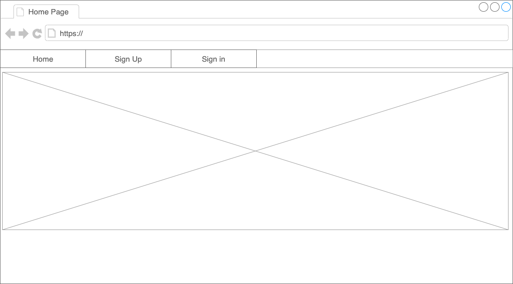
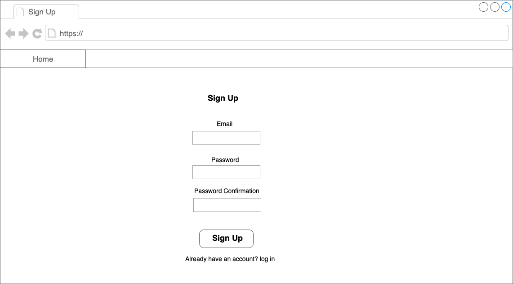
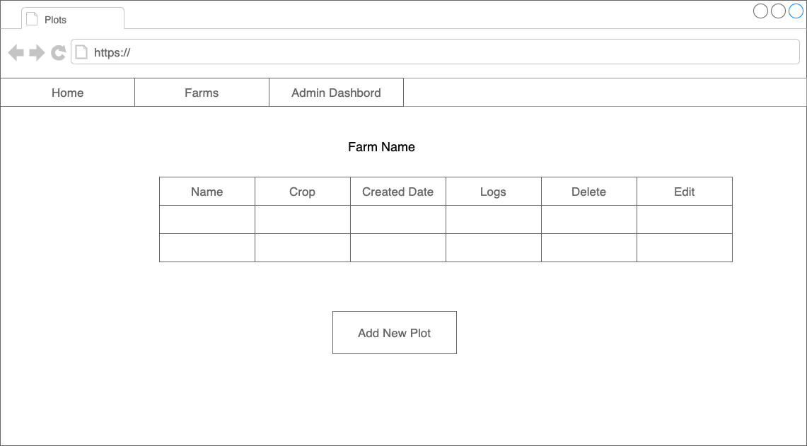
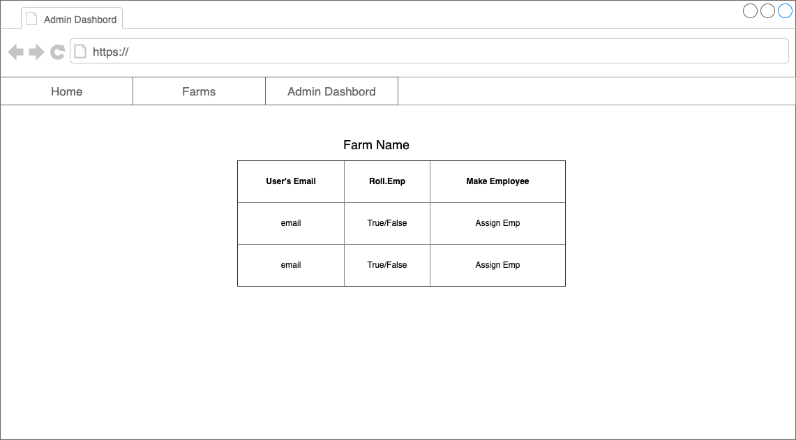
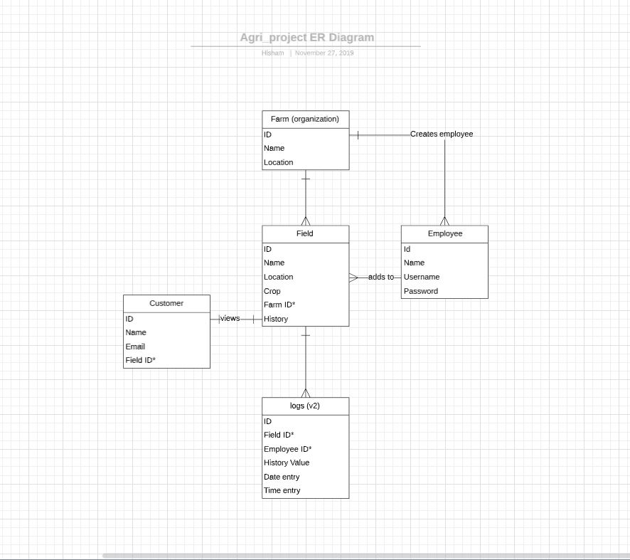
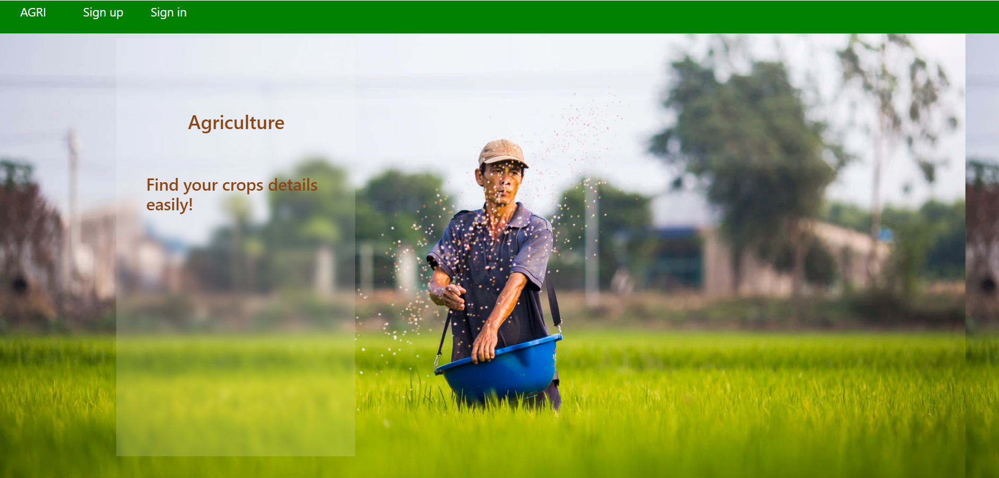

# Project Name
Agriculture Project

## Table of contents
* [General info](#general-info)
* [Screenshots](#screenshots)
* [Technologies](#technologies)
* [Setup](#setup)
* [Features](#features)
* [Status](#status)
* [Inspiration](#inspiration)
* [Contact](#contact)

## General info
The idea of the project is to help farmers and consumers to efficiently monitor field's activities such as products used on fields, watering frequecy etc.

## User Stories
### User stories (Farmer):
-	As farmer, I want to know what employees did in my fields.
-	As farmer, I want to monitor my fields history.
-	As farmer, I want to add\delete employees into my farm.
-	As farmer, I want to add\delete field history.
-	As farmer, I want to select a crop in the field.
### User stories (Employee):
-	As employee, I can sign in/sign out to the website.
-	As employee, I want to access field information with QR code.
-	As employee, I want to fill a form to add what I did in the field.
### User stories (Customer):
-	As customer, I want to access field information with QR code.
-	As customer, I can sign in to the website (Optional).
-	As customer, I want to write comments (Optional).

## Wire Frames









## Screenshots 
### ER Diagram

### App Home Page



## Technologies
The project was created with:

* Ruby - version 2.6.5
* Rails - version 5.2.3
* Devise
* JQuery
* Bootstrap

## Setup
* Clone this repo to your local machine using https://github.com/hamjahb/agri_project.git 
Then in your trminal, run the commands :

```sh
$ bundle install
$ rails db:reset
$ rails s
```
## Features
List of features ready and TODOs for future development

Features
* Monitor farm's activities
* Consumers can view crops history
* Add employes into database

To-do list:
* Add seed bank
* Add IOT monitering systims
* Add drop down selections in logs
* Add QR code scanner
* Add crop images to database

## Status
Version (1) was completed.

The project will have future updates.

## Inspiration
Due to problems agriculture industry is facing: in terms of the quality of their products and customer service. We were insipered to develop an app to solve these problems.

## Contact
Created by 
- @Hisham h.aljahbli@gmail.com
- @Obied obal3588@colorado.edu
- @Lama lamafa97@gmail.com 
- @Raji poower@gmail.com 
- @Abdullah abdullah_rashed.a@icloud.com 

feel free to contact us!